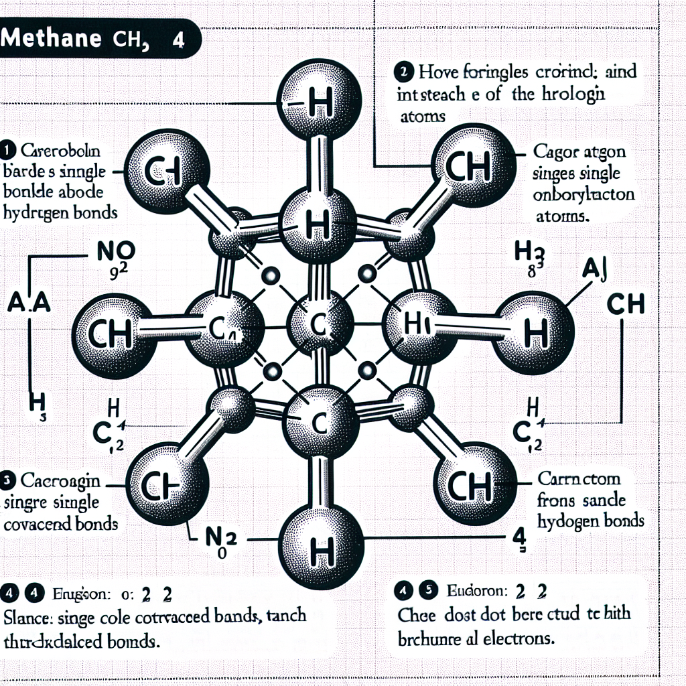

```markdown
# Carbon and its Compounds

## Summary
In CBSE Class 10 Science, the chapter "Carbon and its Compounds" explores the versatile nature of carbon, an element with the atomic number 6 and symbol C. Carbon's tetravalency allows it to form covalent bonds with other carbon atoms and a variety of other elements, enabling the formation of a myriad of compounds. This bonding capability is due to carbon's ability to share its four valence electrons rather than forming unstable ionic bonds. The chapter covers the types of covalent bonds carbon can form, such as single, double, and triple bonds, and highlights the significant role of carbon compounds in both living organisms and synthetic materials. Special attention is given to hydrocarbons, functional groups, and the nomenclature of organic compounds as per the IUPAC system. This knowledge provides a foundation for understanding organic chemistry principles.

- **Covalency of Carbon**: Carbon forms covalent bonds by sharing electrons to achieve stability instead of forming ionic bonds.
- **Allotropes**: Carbon exists in various forms, including diamond, graphite, and fullerenes, each with unique properties and uses.
- **Versatility**: Carbon can form chains, rings, and complex structures due to its abilities to undergo catenation and form multiple bonds.
- **Functional Groups**: Various functional groups impart specific properties to carbon compounds, crucial for classifying organic compounds.
- **Chemical Properties**: Carbon compounds undergo reactions such as combustion, oxidation, and substitution, important for their chemical characterization.


```
